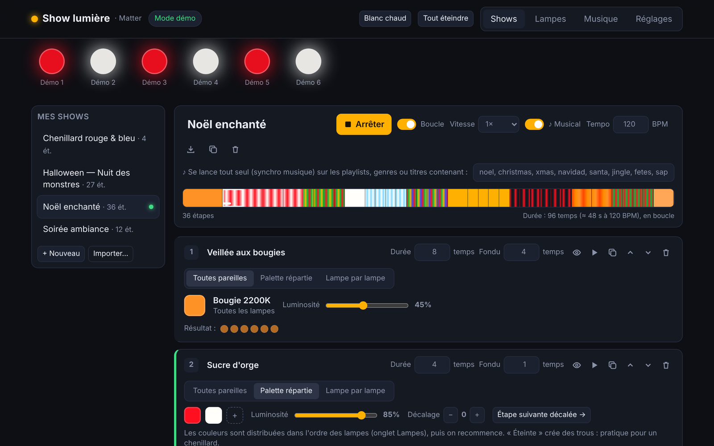
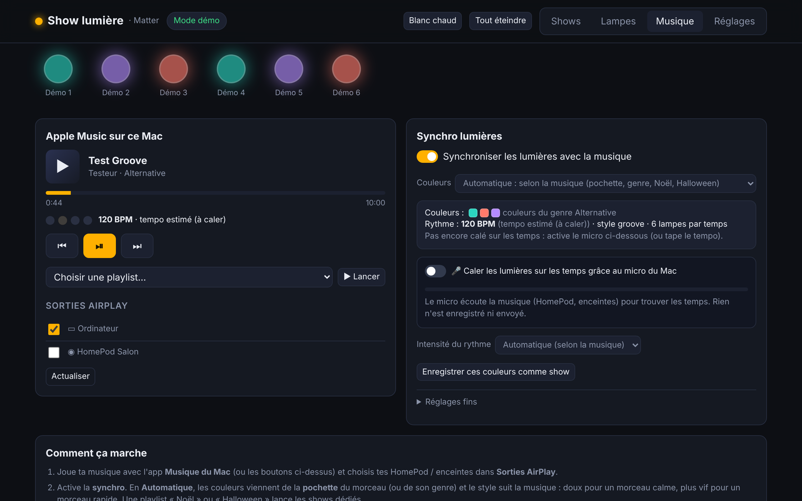
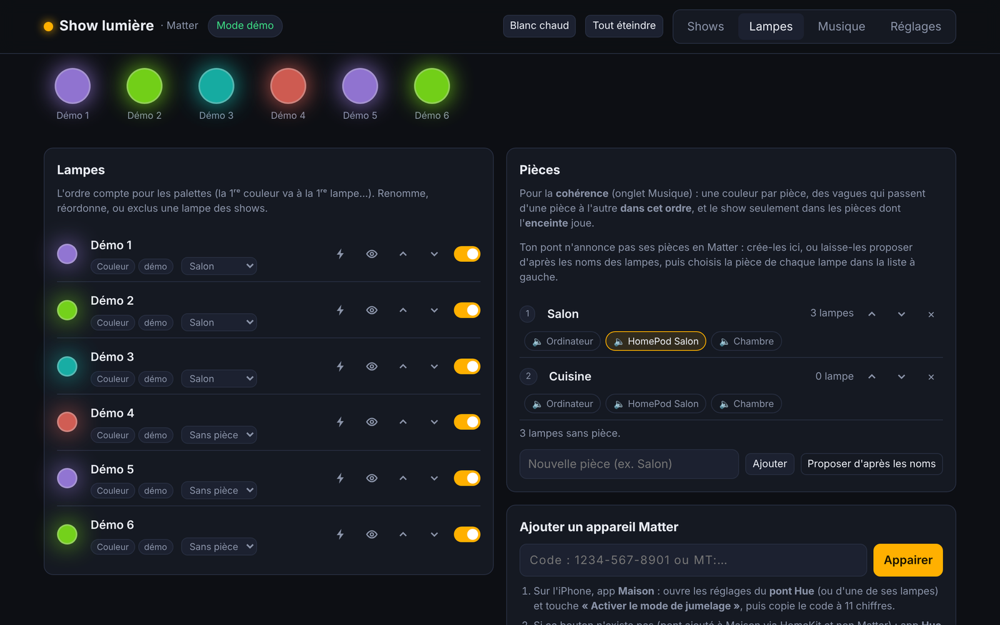

# Matter Light Show 💡🎶

**Turn your Mac into a local Matter controller and play light shows on your smart lamps — synced to the music you play (Apple Music, Spotify, Deezer, Sonos…), controllable from your phone.**

No cloud, no account, no vendor API: the app speaks standard [Matter](https://csa-iot.org/all-solutions/matter/) directly to your lights over your home network. It was built for Philips Hue lamps behind a Hue Bridge, but works with any Matter light — and can also drive **WiZ** bulbs, **Home Assistant** lights and **Zigbee2MQTT** devices.

It is a **native Mac app** (a bulb in the menu bar, Apple Silicon, macOS 14+) with Node.js built in: nothing else to install. It can also run straight from the source code.

🇫🇷 [Lire en français](README.fr.md) · The web interface is in French.







---

## Features

- **Local Matter controller** (multi-admin): pair your Hue Bridge (or any Matter light) with an 11-digit pairing code. Your lights stay in Apple Home / Google Home / Alexa at the same time.
- **Show editor** in the browser: a show is a sequence of steps with a duration and a fade. Three modes per step:
  - *All the same* — one colour for every lamp;
  - *Palette* — a list of colours spread over the lamps, with a shift to create chases and waves;
  - *Lamp by lamp* — per-lamp settings.
- **Music sync** (macOS) — the **Source** setting chooses what the show follows:
  - *Automatic*: whatever app is playing right now;
  - **Apple Music** (with playlists), the **Spotify** Mac app, and **other Mac apps** — Deezer, Tidal, Qobuz, YouTube Music, a browser tab… anything macOS shows in "Now Playing" (macOS 15.4+);
  - **Spotify on all your devices** (iPhone, TV, Spotify Connect speakers — needs Spotify Premium and a free developer app, set up once);
  - **Sonos** speakers, found automatically on your Wi-Fi, no account;
  - **4 automatic colour modes** built from the **album cover** (faces, greys and blacks ignored) plus mood colours picked from the genre, style and tempo — *full*, *sober*, *cover only* and *shades* (the cover colours declined into vivid / light / pastel / dark / deep variants);
  - **genre-aware accents**: every beat for dance and K-pop, beats 2 & 4 for rock and R&B, "one drop" for reggae, slow breathing for classical and ambient…;
  - **style** (calm / groove / energetic) from tempo, genre and the **energy** measured on the 30 s preview;
  - **My colours**: pick up to 6 colours (pastels included); they are arranged into a smooth gradient around the colour wheel (or contrasting halves for energetic songs) and can also be applied as a static ambiance;
  - tempo found automatically (30 s preview analysed in the browser, public BPM databases, or tap tempo);
  - optional **microphone beat alignment** — analysed locally in the browser, nothing recorded or sent;
  - each beat sends a wave of colour across the room, with brightness accents on the downbeat;
  - playlists or songs matching keywords (e.g. "Christmas", "Halloween") start dedicated shows.
- **Audio outputs** in one card (also from your phone): the **Mac's output** (speakers, **Bluetooth speakers and headphones** with connect / disconnect, USB, **TV / display over HDMI**…), **AirPlay** speakers with a volume per speaker, **Spotify Connect** devices and **Sonos** (volume and groups).
- **Rooms & coherence**: group lamps into rooms (suggested from lamp names, or read from Matter labels when the device provides them), link each room to its speakers, then choose one ambiance per room, waves from room to room, a whole room at once, or **only the rooms where music is playing**.
- **Mac app**: a bulb in the menu bar, optional **Open at login**, a **Stop / Start** button (all lamps fade to one colour of your choice), **↻ restart**, light on the Mac (a tiny watcher reports play / pause / next track instantly, nothing polls while idle).
- **Control from your phone**: scan a QR code, add the page to your home screen and drive shows, sync, music, volume and lamps from your iPhone — protected by a secret key / 6-digit code, off by default.
- **Other systems**: WiZ (Wi-Fi, auto-discovered), Home Assistant (all its lights and areas — Zigbee, Smart Life / Tuya, Z-Wave…), Zigbee2MQTT (groups become rooms). Each gateway has its own command rate, so they never wait for the Hue Bridge.
- **Several Wi-Fi networks** (home, office…): each device is bound to the network it was added on; only the accessories of the current network are driven, the others wait quietly.
- **Rate limiting** built in: commands are spread so a Hue Bridge (~10 commands/s) is never flooded.
- **Demo mode**: 6 virtual lamps to design shows without any hardware.
- 4 bundled shows: *Soirée ambiance*, *Chenillard rouge & bleu*, *Halloween — Nuit des monstres*, *Noël enchanté*.

## How it works

```
 Your Mac (this app)  ──Matter / Wi-Fi──▶  Hue Bridge  ──Zigbee──▶  Hue lamps
        ▲                                      ▲
     browser                          Apple Home stays connected in parallel
```

Hue bulbs speak Zigbee, so the Hue Bridge is still needed: it exposes them on the network as Matter devices. The app only sends standard Matter commands (OnOff, LevelControl, ColorControl, Identify) using the open-source [matter.js](https://github.com/matter-js/matter.js) library.

## Requirements

- **Mac app**: an **Apple Silicon** Mac (M1 or later) on **macOS 14 or later**. Node.js is bundled.
- **From the source code**: **Node.js 22.13 or later** ([nodejs.org](https://nodejs.org), LTS). The music sync needs **macOS** (it talks to the music apps); the show editor and the Matter controller are plain Node.js.
- Matter lights on the same local network (Wi-Fi/Ethernet with IPv6, not a guest network, no VPN).

## Install

### The Mac app (easiest)

1. Download `Show-lumiere-x.y.z.zip` from the [**Releases**](https://github.com/badi-project/matter-light-show/releases) page, unzip it and drag **Show lumière** into **Applications**.
2. Open it. The first time, macOS refuses ("Apple cannot verify…") because the app is not notarized by Apple (that needs a paid developer account). Go to **System Settings › Privacy & Security**, scroll down and click **Open Anyway**.
   Terminal alternative: `xattr -dr com.apple.quarantine "/Applications/Show lumière.app"`
3. Answer **Allow** to the macOS prompts — each one serves a precise feature:
   - **Local Network** (required for Matter discovery);
   - **Automation › Music / Spotify** (music sync);
   - **Bluetooth** (connect your Bluetooth speakers);
   - **incoming connections** in the firewall (only if you enable phone control);
   - **Microphone** (only if you enable beat alignment).
4. A bulb appears in the menu bar. To start with the Mac: bulb › **Open at login**. The interface opens in the app window (it is also reachable at <http://localhost:8321> in your browser).

To check the download: `shasum -a 256 Show-lumiere-x.y.z.zip` must match the value given in the Release.

Your data is stored in `~/Library/Application Support/Show lumière/` (never inside the app). **Updating:** replace the app with the new version — your data is kept. macOS may ask for the permissions again after an update.

### From the source code

The server lives in the [`Server/`](Server) folder.

```bash
git clone https://github.com/badi-project/matter-light-show.git
cd matter-light-show/Server
npm ci --omit=dev
node server.mjs
```

Then open <http://localhost:8321>. The data is written to `Server/data/` (git-ignored). The macOS permissions are asked for **node** or your **Terminal**.

> 💡 Put the folder somewhere that is **not synced to iCloud/OneDrive** (e.g. `~/Applications`). When the disk fills up, macOS may evict synced files and the server — including its Matter pairing — stops working.

### Build the app yourself

You need Xcode and a free Apple account to sign the app.

1. Make the scripts executable once (GitHub doesn't keep that permission): `chmod +x Scripts/*.command Scripts/*.sh`
2. Double-click `Scripts/preparer.command`: it downloads the official Node.js (SHA-256 checked) and installs the server modules.
3. Open `ShowLumiere.xcodeproj`. In **Signing & Capabilities**, pick your account as **Team** and **replace the bundle identifier** `fr.showlumiere.mac` with one of your own (e.g. `com.yourname.showlumiere`) — the repository's one is already taken.
4. Run with ▶ (⌘R), or double-click `Scripts/compiler.command`.

To make the zip of a Release (ad hoc signature, no Apple account needed): `Scripts/release.command`.

## Pair your lights

**Lampes › Ajouter un appareil Matter** (Lamps › Add a Matter device):

1. In the **Apple Home** app, open the Hue Bridge settings and tap **Turn On Pairing Mode**, then copy the 11-digit code.
   If the bridge was added to Home through HomeKit rather than Matter, generate the code in the **Hue app › Settings › Smart Home / Matter** instead.
2. Paste the code and click **Appairer** within ~15 minutes.

All lamps of the bridge appear. You can rename them, reorder them (the order is used by palettes), hide them from shows, or make them blink to identify them.

Removing a device (**Retirer**) only removes this controller's fabric — the device stays in your other apps.

## Music sync

In the **Musique** tab, play music in your usual app, then turn on **Synchroniser les lumières avec la musique**. The **Source** selector decides what the show follows (automatic, Apple Music, Spotify, other Mac apps, Spotify on all devices, Sonos — see the features above). Then choose where the colours come from:

- **Automatic** colours — four modes:
  - *Auto complet* (default): main cover colours + mood colours from genre, style and tempo (fewer, softer, warmer colours for calm songs; more saturated ones with an "impact" colour for energetic songs);
  - *Auto sobre*: cover colours + only 2 mood colours;
  - *Auto pochette*: cover colours only (white light for a black & white cover);
  - *Auto nuances*: cover colours declined into shades, flavoured by the genre (vivid for K-pop/electro, deep for jazz/R&B, soft pastel for indie/folk, contrasted for rock);
- **Mes couleurs**: your own palette (up to 6 colours), auto-arranged; **Diffuser maintenant** applies it without music;
- or pick **one of your shows**: its colours are kept and the music drives the rhythm;
- **Rhythm intensity**: auto, soft, medium, strong or none;
- **Save these colours as a show** turns the automatic palette into an editable show.

The genre is read from the music app, Apple and Deezer (or guessed from the audio when missing); it also picks the accent pattern. Apps that don't report the position inside the song get an estimated one: turn on the microphone to align the lights on the beat.

### Rooms and coherence

In **Lampes › Pièces**, create rooms or click **Proposer d'après les noms** (e.g. "Bedroom lamp" → Chambre, "Kitchen 1/2" → Cuisine, "Garden 1/2/3" → Jardin; French and English keywords, otherwise lamps sharing a name prefix are grouped), fix each lamp's room, order the rooms (this is the wave order) and link each room to its speakers. A Hue Bridge doesn't expose its rooms over Matter, so this is done by hand; if a device does announce room labels in Matter, they are used automatically.

Then, under the colours in the **Musique** tab, choose a **coherence** mode:
- **One ambiance per room**: one dominant colour per room with close shades between its lamps;
- **Waves from room to room**: each change starts in the first room and travels in room order;
- **A whole room at once**: all lamps of a room change together, rooms answer each other on the beat (works best with the bridge rate limit);
- **Only where the music plays**: the show only runs in rooms whose speaker is really playing (ticked AirPlay speaker, Mac output such as Bluetooth or a TV, Spotify device, Sonos group); other rooms go soft white, turn off or stay unchanged.

To look up cover art, the 30 s preview, genre and BPM, the app sends the **song title and artist** to the public **iTunes Search** and **Deezer** APIs (no account, no key). Colour, tempo and energy analyses run in your browser; results are cached locally for 30 days. Spotify is only contacted if you connect your own account.

## Menu bar, Stop / Start

- The **bulb in the menu bar** opens the window, shows the log and has **Open at login**.
- **⏻ Arrêter / Démarrer** (top of the page): *Stop* ends the show and the sync and fades **all lamps to one colour** (or off) — *Start* resumes where you were. **↻** restarts the server. **Quitter complètement** shuts it down; the page then shows a **▶ Démarrer le show** button that reopens the app (`showlumiere://` link).
- The Mac is kept awake while a show or the sync is running (not when stopped).

## Control from your phone

On the Mac, **Réglages › 📱 Téléphone** › turn on phone control. Scan the QR code with the iPhone camera, open the link, then in Safari **Share › Add to Home Screen** to get a Show lumière icon like an app. Without the QR code, type the address shown (`http://<your-mac>.local:8321`) and the **6-digit code**.

- Off by default; the server only listens on the local network while it is on.
- Phones need the secret key (from the QR code) or the code — 5 wrong codes lock logins for 5 minutes. **Changer la clé** disconnects every phone.
- Some actions stay Mac-only (quit, restart). The Mac is kept awake while the option is on (configurable); a closed or sleeping Mac can't be reached.

## Other systems

In **Lampes › Autres systèmes**:
- anything with a **Matter code** pairs like the Hue Bridge (IKEA DIRIGERA, Aqara, SmartThings, Matter-compatible Smart Life / Tuya, Nanoleaf, Eve, Govee, WiZ, Meross…) — the **Ton matériel** menu gives brand-specific steps;
- **Zigbee bulbs** of any brand (IKEA, Innr, Lidl, Ledvance…): easiest is to add them to the Hue Bridge;
- **WiZ** (Wi-Fi): driven directly over UDP, found automatically (optional fixed IPs);
- **Home Assistant**: all its lights and areas, with its address and a **long-lived access token**;
- **Zigbee2MQTT**: lights on a USB Zigbee stick via your MQTT broker; its groups become rooms;
- **Smart Life / Tuya without Matter**: go through Home Assistant.

Tokens and passwords are stored in `data/systemes.json` (never sent back to the page in clear).

## Configuration

| Variable | Default | Purpose |
|---|---|---|
| `PORT` | `8321` | HTTP port |
| `HOST` | – | Force the listening address. By default the server listens on `127.0.0.1`, or on the local network when phone control is enabled (with key / code protection). |
| `SHOW_DATA_DIR` | `Server/data` | Where personal data is written (the Mac app sets it to `~/Library/Application Support/Show lumière/data`) |
| `SHOW_SHOWS_DIR` | `Server/shows` | Where your shows are saved |
| `MATTER_DEBUG` | – | Verbose matter.js logs |
| `MUSIC_SIM` | – | Simulated music player (for development without a Mac) |

Other settings (max command rate, light lead time, demo mode…) are in the **Réglages** tab, along with **Redémarrer le logiciel** (restart the server — available when it was started by the Mac app, which relaunches it).

## Your data stays on your machine

Everything personal is written to a **data folder**, never inside the app and never in this repository: `~/Library/Application Support/Show lumière/` for the Mac app, or `Server/data/` (**git-ignored**) when you run the source code.

| Path (in the data folder) | Contents |
|---|---|
| `data/matter/` | Matter controller identity and fabric credentials, paired devices — **never share this** |
| `data/systemes.json` | Other systems settings, including the **Home Assistant token** and MQTT password — **never share this** |
| `data/acces.json` | Phone-control key and code — **never share this** |
| `data/lampes.json` | Lamp names, order, hidden lamps |
| `data/pieces.json` | Your rooms, their lamps and speakers |
| `data/reglages.json` | Settings (including *My colours*) |
| `data/tempos.json` | Calibrated tempos |
| `data/morceaux/` | Cached cover art, previews and analyses of the songs you played |

The Mac app's logs are in `~/Library/Logs/Show lumière/`.

Shows you create are saved to `shows/` next to `data/` (git-ignored in the repository, except the 4 bundled ones). Use **Exporter / Importer** to share a show as a `.json` file.

## Show file format

```jsonc
{
  "name": "Chenillard rouge & bleu",
  "loop": true,
  "speed": 1,
  "tempo": { "bpm": 118 },              // optional: durations are then counted in beats
  "music": { "match": ["halloween"] },  // optional: auto-start keywords for music sync
  "steps": [
    {
      "name": "Step 1",
      "duration": 1.2,                  // seconds (or beats if tempo is set)
      "fade": 0.4,
      "mode": "palette",                // "all" | "palette" | "custom"
      "palette": { "colors": ["#ff0000", "off", "#2040ff", "off"], "brightness": 100, "shift": 0 },
      "all":     { "on": true, "color": "2700K", "brightness": 80 },
      "lamps":   { "<lampId>": { "on": true, "color": "#00ff88", "brightness": 60 } }
    }
  ]
}
```

Colours are `#rrggbb`, a colour temperature like `2700K`, or `off`.

## Project structure

```
ShowLumiere.xcodeproj   Xcode project of the Mac app
ShowLumiere/            The app (Swift, AppKit + SwiftUI): menu bar, window, server launcher, first-run migration
Config/                 Info.plist and entitlements (app and embedded Node)
Scripts/                preparer (downloads Node), compiler, release (ad hoc zip), embed-server, preparer-publication
Server/                 The server — works on its own with `node server.mjs`
  server.mjs            Start-up
  lib/app/              The software: lamps, music, start / stop, web server, events
  lib/routes/           The REST API (+ Server-Sent Events), by theme
  lib/matter.mjs        Matter controller: pairing, lamp discovery, commands (matter.js)
  lib/devices.mjs       Device hub: Matter + drivers, one command queue per gateway
  lib/drivers/          WiZ (UDP), Home Assistant (REST), Zigbee2MQTT (MQTT) drivers
  lib/mqtt-mini.mjs     Minimal MQTT 3.1.1 client
  lib/network.mjs       Wi-Fi networks: each device belongs to the network it was added on
  lib/remote.mjs        Phone access: key, 6-digit code, QR code, login page
  lib/vendor/           QR Code Generator by Kazuhiko Arase (MIT)
  lib/show.mjs          Show engine: step resolution, player, rate-limited dispatcher
  lib/color.mjs         Colour conversions (hex → CIE xy / hue-sat, Kelvin → mireds)
  lib/palette.mjs       Colour arrangement (gradient / contrast) and shades
  lib/rooms.mjs         Rooms: suggestions from names, speaker links, per-room targets
  lib/music.mjs         Apple Music via osascript (state, transport, playlists, AirPlay, volume) + simulator
  lib/sources.mjs       Music sources: Apple Music, Spotify, "Now Playing" apps, Spotify Connect
  lib/sonos.mjs         Sonos speakers (local network)
  lib/audio.mjs         Audio outputs: Mac output, Bluetooth, HDMI
  lib/macos.mjs, macwatch.mjs, jxa/   macOS glue and the tiny play / pause watcher
  lib/online.mjs        Song info from public iTunes Search / Deezer APIs (cached)
  lib/genre.mjs         Genre families, energy, style, accent patterns, palette building
  lib/autoshow.mjs      Automatic shows from cover/genre palettes
  lib/tempo.mjs         Known tempos, BPM normalisation, tap tempo
  lib/sync.mjs          Music sync: beat clock, waves, rooms and accents
  public/               The web interface (vanilla JS: index.html, app.css, js/) and in-browser analyses (analyse.js: cover colours in OKLab, tempo, energy)
  shows/                Bundled shows
docs/                   Screenshots
```

## Known limitations

- A Hue Bridge accepts roughly **10 Matter commands per second**. With many lamps, only a few change on each beat (changing a big room takes several beats); raise the max rate in Réglages (15–20) if your bridge keeps up.
- A Hue Bridge doesn't share its rooms over Matter: rooms must be set up in the app.
- Analyses run in the page: keep the web interface open (at least once per song).
- Not available through Matter: Hue gradient effects, Hue Entertainment sync, Hue scenes.
- "Now Playing" apps need macOS 15.4 or later; Spotify on other devices needs Premium and a free developer app.
- The Mac must stay awake during the show (the app keeps it awake while a show or the sync runs).
- The app is not notarized (no paid Apple developer account): the first launch needs **Open Anyway**, and macOS may ask for the permissions again after an update. The app is built for Apple Silicon only.

## Troubleshooting

| Problem | What to check |
|---|---|
| Pairing fails | The code may have expired — generate a new one. Same network as the bridge (no guest Wi-Fi, no VPN). *Local Network* permission granted to **Show lumière** (or to Terminal when run from the source). |
| Bridge stuck on "recherche sur le réseau…" | Bridge off or the computer changed network; it reconnects automatically. |
| A lamp "ne répond plus" | It is marked unreachable and retried every 30 s; the rest of the show goes on. Check it is powered; for a **Thread** bulb, that the HomePod / Apple TV acting as Thread router is on. |
| Lamps lag behind | Longer steps, fewer lamps per step, or lower the max rate. |
| Lights don't follow the music | Music must play **on this Mac** (Apple Music, Spotify, Deezer…) or, with a connected Spotify account, on a Spotify device. Look at the "Suivi : …" line in the *Musique* tab or force the **Source**. Permissions: *Automation › Show lumière › Music / Spotify*. |
| A Bluetooth speaker won't connect | Switch it on and bring it closer; disconnect it from a phone first. If an **Autoriser** button shows, click it and accept the macOS Bluetooth prompt (or System Settings › Privacy & Security › Bluetooth). |
| Lights are off-beat | Enable the microphone (or tap the tempo), then adjust the light lead in *Réglages fins*. |
| The page doesn't open any more | Open the app (bulb › **Ouvrir la fenêtre**): it restarts the server. Log: `~/Library/Logs/Show lumière/serveur.log` (bulb › **Voir le journal**). |
| Music not followed / bridge unreachable | System Settings › Privacy & Security › **Local Network** › enable **Show lumière**, and **Automation** › Show lumière › Music. Then ↻. (From Terminal it is `node` / Terminal that needs the permissions.) |
| The phone can't open the page | Same Wi-Fi? Mac awake? Try the "IP address" link in Réglages › Téléphone; allow **node** in the macOS firewall. |
| The app does nothing | macOS blocks it the first time (System Settings › Privacy & Security › **Open Anyway**). Its log is `~/Library/Logs/Show lumière/app.log`. |
| Accessories disappeared | The Mac may have joined another Wi-Fi: they belong to the network where you added them (card 📶 Réseau in *Lampes*). |

The full French user guide is [`Server/LISEZMOI.md`](Server/LISEZMOI.md).

## Credits

Built on [matter.js](https://github.com/matter-js/matter.js) (Apache-2.0). QR codes by [QR Code Generator](https://github.com/kazuhikoarase/qrcode-generator) (Kazuhiko Arase, MIT). The app embeds the official [Node.js](https://nodejs.org) binary (MIT). Cover art, previews and BPM come from the public iTunes Search and Deezer APIs and belong to their respective owners; they are only cached locally.

Not affiliated with Philips Hue, Signify, Apple, Spotify, Deezer, Sonos, IKEA, WiZ, Home Assistant or the Connectivity Standards Alliance.

## License

[MIT](LICENSE)
